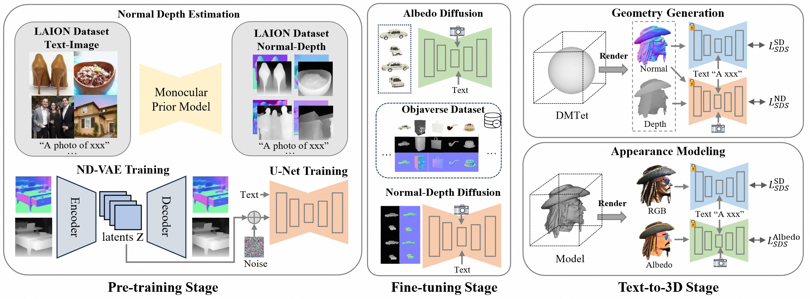

<p align="center">
    <br>
    
    <br>
    <h1>RichDreamer</h1>
<p>

RichDreamer: A Generalizable Normal-Depth Diffusion Model for Detail Richness in Text-to-3D.

[Lingteng Qiu\*](https://lingtengqiu.github.io/),
[Guanying Chen\*](https://guanyingc.github.io/),
[Xiaodong Gu\*](https://scholar.google.com.hk/citations?user=aJPO514AAAAJ&hl=zh-CN&oi=ao),
Qi Zuo,
[Mutian Xu](https://mutianxu.github.io/),
Yushuang Wu,
[Weihao Yuan](https://weihao-yuan.com/),
[Zilong Dong](https://scholar.google.com/citations?user=GHOQKCwAAAAJ&hl=zh-CN&oi=ao),
[Liefeng Bo](https://research.cs.washington.edu/istc/lfb/),
[Xiaoguang Han](https://gaplab.cuhk.edu.cn/)

如果您熟悉中文，可以阅读[中文版本的README](./README_ZH.md)。

Our method is based on Normal-Depth diffusion Model, for more details please refer to [normal-depth-diffusion](https://github.com/modelscope/normal-depth-diffusion).

## [Project page](https://aigc3d.github.io/richdreamer) | [Paper](https://arxiv.org/abs/2311.16918) | [YouTube](https://youtu.be/6gQ1VWiKoc0) | [ND-Diffusion Model](https://github.com/modelscope/normal-depth-diffusion) | [3D Rendering Dataset](https://aigc3d.github.io/gobjaverse)


## TODO  :triangular_flag_on_post:
- [x]  Text to ND Diffusion Model
- [x]  Multiview-ND and Multiview-Albedo Diffusion Models
- [x]  Release code
- [x]  Provide the generation trial on [ModelScope's 3D Object Generation](https://modelscope.cn/studios/Damo_XR_Lab/3D_AIGC/summary)
- [x]  Docker image


## News
- RichDreamer is got accepted by CVPR2024. (**Highlight**) (04.04, 2024 UTC)
- [ModelScope's 3D Object Generation](https://modelscope.cn/studios/Damo_XR_Lab/3D_AIGC/summary) is online. Have a try :fire::fire::fire: (12.22, 2023 UTC)
- Release RichDreamer :fire::fire::fire: (12.11, 2023 UTC)

## Architecture




# Install

- System requirement: Ubuntu20.04
- Tested GPUs: RTX4090, A100

Install requirements using following scripts.

```bash
git clone https://github.com/modelscope/RichDreamer.git --recursive
conda create -n rd
conda activate rd
# install dependence of threestudio
pip install -r requirements_3d.txt
```

we also provide a dockerfile to build docker image or use our built [docker image](registry.cn-hangzhou.aliyuncs.com/ailab-public/aigc3d).

```bash
sudo docker build -t mv3dengine_22.04:cu118 -f docker/Dockerfile .
# or use our built docker image
sudo docker pull registry.cn-hangzhou.aliyuncs.com/ailab-public/aigc3d
```

Download pretrained weights.

1. MultiView Normal-Depth Diffusion Model (ND-MV)
2. MultiView Depth-conditioned Albedo Diffusion Model (Alebdo-MV)


**Or** your can download weights using the following scripts.

```bash
python tools/download_nd_models.py
# copy 256_tets file for dmtet.
cp ./pretrained_models/Damo_XR_Lab/Normal-Depth-Diffusion-Model/256_tets.npz ./load/tets/
# link your huggingface models to ./pretrained_models/huggingface
cd pretrained_models && ln -s ~/.cache/huggingface ./
```

if you cannot visit huggingface to download SD 1.5, SD 2.1 and CLIPs, you can download SD and CLIP models from [aliyun](https://virutalbuy-public.oss-cn-hangzhou.aliyuncs.com/share/RichDreamer/models_sd_clip.tar.gz) and then put `$download_sd_clip` file to `pretrained_models/huggingface/hub/`.

```bash
mkdir -p pretrained_models/huggingface/hub/
cd pretrained_models/huggingface/hub/
mv /path/to/${download_sd_clip} ./
tar -xvf ${download_sd_clip} ./
```

## Generation
Make sure you have the following models.
```bash
RichDreamer
|-- pretrained_models
    |-- Damo_XR_Lab
        |-- Normal-Depth-Diffusion-Model
            |-- nd_mv_ema.ckpt
            |-- albedo_mv_ema.ckpt
    
    |-- huggingface
        |-- hub
            |-- models--runwayml--stable-diffusion-v1-5
            |-- models--openai--clip-vit-large-patch14
            |-- models--stabilityai--stable-diffusion-2-1-base
            |-- models--laion--CLIP-ViT-H-14-laion2B-s32B-b79K
```
Note we setting environment variable `TRANSFORMERS_OFFLINE=1 DIFFUSERS_OFFLINE=1 HF_HUB_OFFLINE=1` in all `*.sh` file before running command to prevent from connecting to huggingface each time.

If you using above script to download SD and CLIP models, you do nothing, if you download via huggingface api, `in first run`, you need to set `TRANSFORMERS_OFFLINE=0 DIFFUSERS_OFFLINE=0 HF_HUB_OFFLINE=0` in `*.sh` and it will connect hugging face and automatic download models.


### Our (NeRF)

```bash
# Quick Start, Single A-100 80G
python3 ./run_nerf.py -t $prompt -o $output

# Run from prompt list
# e.g. bash ./scripts/nerf/run_batch.sh 0 1 ./prompts_nerf.txt
# We also provide run_batch_res256.sh to optimize using high-resolution rendering images to achieve better results, but it will consume more memory and time.
bash ./scripts/nerf/run_batch.sh $start_id $end_id ${prompts_nerf.txt}

# If you don't have an A-100 device, we offer a save memory version to generate results.
# For single GTX-3090/4090, 24GB GPU memory.
# e.g. bash ./scripts/nerf/run_batch_fast.sh 0 1 ./prompts_nerf.txt
# or e.g. python3 ./run_nerf.py -t "a dog, 3d asset" -o ./outputs/nerf --img_res 128 --save_mem 1
bash ./scripts/nerf/run_batch_fast.sh $start_id $end_id ${prompts_nerf.txt}
# or using:
python3 ./run_nerf.py -t "$prompt" -o $output --img_res 128 --save_mem 1
```

### Our (DMTet)

#### Tips for Training DMTet

**1. Rendering High-resolution:**

We found that optimizing a high-resolution DMTet sphere directly is more challenging compared to the NeRF method.  For example, both Fantasia3D and SweetDreamer require 4 or 8 GPUs for  optimization, which is difficult to obtain for most individuals. During the experimental process, we observed that optimization becomes  significantly more stable when we increase the rendering resolution of  DMTet, such as to **1024**. This trick allows us to optimize from DMTet using only a single GPU, which was previously not feasible.

**2. PBR Modeling:**

Fantasia3D offers three strategies for conducting PBR modeling.  If you **Do Not** require generating models that support relighting and only aim for enhanced realism, we recommend using the sampling strategy  *fantasia3d_2*. **Otherwise** we suggest you to use *fantasia3d strategy_0* with our *depth condition albedo-sds*.


```bash
# Quick Start, Single A-100 80G
python3 ./run_dmtet.py -t "$prompt" -o $output

# Run from prompt list
# e.g. bash ./scripts/nerf/run_batch.sh 0 1 ./prompts_dmtet.txt
bash ./scripts/dmtet/run_batch.sh $start_id $end_id ${prompts_dmtet.txt} 

# If you don't have an A-100 device, we offer a save memory version to generate results.
# For single GTX-3090/4090, 24GB GPU memory.
# bash ./scripts/dmtet/run_batch_fast.sh 0 1 ./prompts_dmtet.txt
bash ./scripts/dmtet/run_batch_fast.sh $start_id $end_id ${prompts_dmtet.txt}
```


## Acknowledgement

This work is built on many amazing research works and open-source projects:

- [Stable-Dreamfusion](https://github.com/ashawkey/stable-dreamfusion)
- [threestudio](https://github.com/threestudio-project/threestudio)
- [Fantasia3D](https://github.com/Gorilla-Lab-SCUT/Fantasia3D)
- [MVDream](https://github.com/bytedance/MVDream-threestudio)

Thanks for their excellent work and great contribution to 3D generation area.

We would like to express our special gratitude to [Rui Chen](https://aruichen.github.io/) for the valuable discussion in training Fantasia3D and PBR modeling. 

Additionally, we extend our heartfelt thanks to Chao Xu for his assistance in conducting relighting experiments.

## Citation	

```
@inproceedings{qiu2024richdreamer,
  title={Richdreamer: A generalizable normal-depth diffusion model for detail richness in text-to-3d},
  author={Qiu, Lingteng and Chen, Guanying and Gu, Xiaodong and Zuo, Qi and Xu, Mutian and Wu, Yushuang and Yuan, Weihao and Dong, Zilong and Bo, Liefeng and Han, Xiaoguang},
  booktitle={Proceedings of the IEEE/CVF Conference on Computer Vision and Pattern Recognition},
  pages={9914--9925},
  year={2024}
}
```

