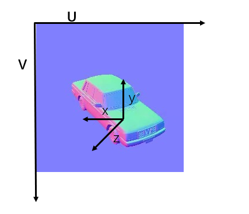
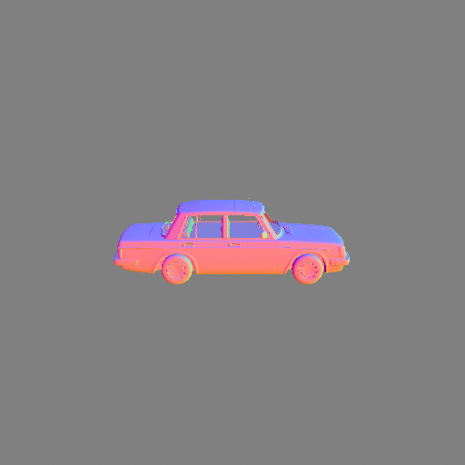

<p align="center">
    <h1>G-buffer Objaverse</h1>
<p>

G-buffer Objaverse: High-Quality Rendering Dataset of Objaverse.

[Chao Xu](mailto:eric.xc@alibaba-inc.com),
[Yuan Dong](mailto:yuandong15@fudan.edu.cn),
[Qi Zuo](mailto:muyuan.zq@alibaba-inc.com),
[Junfei Zhang](mailto:miracle.zjf@alibaba-inc.com),
[Xiaodan Ye](mailto:doris.yxd@alibaba-inc.com),
[Wenbo Geng](mailto:rengui.gwb@alibaba-inc.com),
[Yuxiang Zhang](mailto:yuxiangzhang.zyx@alibaba-inc.com),
[Xiaodong Gu](https://scholar.google.com.hk/citations?user=aJPO514AAAAJ&hl=zh-CN&oi=ao),
[Lingteng Qiu](https://lingtengqiu.github.io/),
[Zhengyi Zhao](mailto:bushe.zzy@alibaba-inc.com),
[Qing Ran](mailto:ranqing.rq@alibaba-inc.com),
[Jiayi Jiang](mailto:jiayi.jjy@alibaba-inc.com),
[Zilong Dong](https://scholar.google.com/citations?user=GHOQKCwAAAAJ&hl=zh-CN&oi=ao),
[Liefeng Bo](https://scholar.google.com/citations?user=FJwtMf0AAAAJ&hl=zh-CN)

## [Project page](https://aigc3d.github.io/gobjaverse/) | [YouTube](https://www.youtube.com/watch?v=PWweS-EPbJo) | [RichDreamer](https://aigc3d.github.io/richdreamer/) | [ND-Diffusion Model](https://github.com/modelscope/normal-depth-diffusion)

## TODO
- [x]  Release objaverse-xl alignment rendering data

## News

- We have released a compressed version of the datasets, check the downloading tips! (01.14, 2024 UTC)
- Thanks for [JunzheJosephZhu](https://github.com/JunzheJosephZhu) for improving the robustness of the downloading scripts. Now you could restart the download script from the break point. (01.12, 2024 UTC)
- Release 10 Category Annotation of the Objaverse Subset (01.06, 2024 UTC)
- Release G-buffer Objaverse Rendering Dataset (01.06, 2024 UTC)
- Release Objaverse-XL Alignment Rendering Data (07.06, 2024 UTC)

## Download
- $\color{red}{\textsf{Please give us a ⭐star⭐ if you think the data helpful. Thanks!!!}}$ 😁😁😁
### G-Objaverse
- Download gobjaverse ***(6.5T)*** rendering dataset using following scripts.
```bash
# download_gobjaverse_280k index file
wget https://virutalbuy-public.oss-cn-hangzhou.aliyuncs.com/share/aigc3d/gobjaverse_280k.json
# Example: python ./scripts/data/download_gobjaverse_280k.py ./gobjaverse_280k ./gobjaverse_280k.json 10
python ./download_gobjaverse_280k.py /path/to/savedata /path/to/gobjaverse_280k.json nthreads(eg. 10)
# Or if the network is not so good, we have provided a compressed verison with each object as a tar file
# To download the compressed version(only 260k tar files)
python ./download_objaverse_280k_tar.py /path/to/savedata /path/to/gobjaverse_280k.json nthreads(eg. 10)
# download gobjaverse_280k/gobjaverse index to objaverse
wget https://virutalbuy-public.oss-cn-hangzhou.aliyuncs.com/share/aigc3d/gobjaverse_280k_index_to_objaverse.json
wget https://virutalbuy-public.oss-cn-hangzhou.aliyuncs.com/share/aigc3d/gobjaverse_index_to_objaverse.json
# download Cap3D text-caption file
wget https://virutalbuy-public.oss-cn-hangzhou.aliyuncs.com/share/aigc3d/text_captions_cap3d.json

```
- Download the category annotation using following scripts.
- The 10 general categories including Human-Shape (41,557), Animals (28,882), Daily-Used (220,222), Furnitures (19,284), Buildings&&Outdoor (116,545), Transportations (20,075), Plants (7,195), Food (5,314), Electronics (13,252) and Poor-quality (107,001).

```bash
# download category annotation
wget https://virutalbuy-public.oss-cn-hangzhou.aliyuncs.com/share/aigc3d/category_annotation.json
# If you want to download a specific category in gobjaverse280k:
# Step1: download the index file of the specified category.
wget https://virutalbuy-public.oss-cn-hangzhou.aliyuncs.com/share/aigc3d/gobjaverse_280k_split/gobjaverse_280k_{category_name}.json # category_name: Human-Shape, ...
# Step2: download using script.
# Example: python ./scripts/data/download_gobjaverse_280k.py ./gobjaverse_280k_Human-Shape ./gobjaverse_280k_Human-Shape.json 10
python ./download_gobjaverse_280k.py /path/to/savedata /path/to/gobjaverse_280k_{category_name}.json nthreads(eg. 10)
```

### G-Objaverse-XL Alignment
- The Objaverse-XL alignment dataset is a high-quality subset of Objaverse-XL that contains approximately 1 million objects, of which we successfully rendered 779,325. We also provide the number of rendered objects for different file types, as shown in the table below.

| Source    | FileType | Number of Rendered Objects | Start Index        | End Index        | Mapping File |
|-----------|----------|----------------------------|--------------------|------------------|--------------|
| github    | glb      | 62267                      | 1246/6228026       | 1283/6414711     | wget https://virutalbuy-public.oss-cn-hangzhou.aliyuncs.com/share/aigc3d/gobjaverse_xl_alignment_map/glb_map.json             |
| github    | fbx      | 285505                     | 1284/6414713       | 1585/7924430     | wget https://virutalbuy-public.oss-cn-hangzhou.aliyuncs.com/share/aigc3d/gobjaverse_xl_alignment_map/fbx_map.json             |
| github    | obj      | 91083                      | 921/4607943        | 1245/6228025     | wget https://virutalbuy-public.oss-cn-hangzhou.aliyuncs.com/share/aigc3d/gobjaverse_xl_alignment_map/obj_map.json             |
| github    | gltf     | 0                          | -                  | -                | -            |
| github    | blend    | 0                          | -                  | -                | -            |
| github    | dae      | 0                          | -                  | -                | -            |
| github    | usdz     | 0                          | -                  | -                | -            |
| sketchfab | glb      | 340470                     | 1871/9348643       | 1945/9718918     | wget https://virutalbuy-public.oss-cn-hangzhou.aliyuncs.com/share/aigc3d/gobjaverse_xl_alignment_map/sketchfab_map.json        |

- Download objaverse-xl alignment rendering dataset (779325) using following scripts.
```bash
# download_gobjaverse_alignment url file
wget https://virutalbuy-public.oss-cn-hangzhou.aliyuncs.com/share/aigc3d/gobjaverse_alignment.json
# Example: python ./scripts/data/download_gobjaverse_alignment.py --json_path gobjaverse_alignment.json --save_dir /path/save_dir
python ./download_gobjaverse_alignment.py --json_path gobjaverse_alignment.json --save_dir ./gobjaverse_alignment
```
- If you find this dataset useful and have cleaned and filtered it further, we would appreciate being contacted for updates！


## Folder Structure
- The structure of gobjaverse rendering dataset:
```
|-- ROOT
    |-- dictionary_id
        |-- instance_id
            |-- campos_512_v4
                |-- 00000
                    |-- 00000.json  # Camera Information
                    |-- 00000.png   # RGB 
                    |-- 00000_albedo.png  # Albedo 
                    |-- 00000_hdr.exr  # HDR
                    |-- 00000_mr.png  # Metalness and Roughness
                    |-- 00000_nd.exr  # Normal and Depth
                |-- ...
```

### Coordinate System

#### Normal Coordinate System

The 3D coordinate system definition is very complex. it is difficult  for us to say  what the camera system used. Fortunately, the target  we want to get is mapping the world normal of rendering system to Normal-Bae system,  as the following figure  illustrates:



where the U-axis and V-axis denote the width-axis and height-axis in image space, respectively, the xyz is the Normal-Bae camera view coordinate system. 

Note that public rendering  system  for Objaverse is blender-based system:



However, our rendering system is defined  at **Unity-based system**, seeing:


*A question is how do we plug in blender's coordinate system directly without introducing a new coordinate system?*

A possible solution is that we maintain world to camera  transfer matrix as blender setting, *transferring Unity-based system to blender-based system*

We provide example codes to visualize the coordinate mapping.

```bash
# example of coordinate experiments
## download datasets
wget https://virutalbuy-public.oss-cn-hangzhou.aliyuncs.com/share/Lingtengqiu/render_data_examples.zip
unzip render_data_examples.zip

## visualizing blender-based system, and warping world-space normal to normal-bae system.
python ./process_blender_dataset.py

## visualizing our system, and warping world-space normal to normal-bae system.
python ./process_unity_dataset.py
```

#### Depth-Warpping 
We write an example to demonstrate that how to obtain intrinsic matrix K, and warp ref image to target image based on ref depth map. 

```bash
# build quick-zbuff code
mkdir -p ./lib/build
g++ -shared -fpic -o ./lib/build/zbuff.so ./lib/zbuff.cpp

# an demo for depth-based Warpping 
# python ./depth_warp_example.py $REFVIEW $TARGETVIEW
python3 ./depth_warp_example.py 0 3
```


## Citation	

```
@article{qiu2023richdreamer,
    title={RichDreamer: A Generalizable Normal-Depth Diffusion Model for Detail Richness in Text-to-3D}, 
    author={Lingteng Qiu and Guanying Chen and Xiaodong Gu and Qi zuo and Mutian Xu and Yushuang Wu and Weihao Yuan and Zilong Dong and Liefeng Bo and Xiaoguang Han},
    year={2023},
    journal = {arXiv preprint arXiv:2311.16918}
}
```
```
@inproceedings{zuo2024sparse3d,
     title={High-Fidelity 3D Textured Shapes Generation by Sparse Encoding and Adversarial Decoding},
     author={Zuo, Qi and Gu, Xiaodong and Dong, Yuan and Zhao, Zhengyi and Yuan, Weihao and Qiu, Lingteng and Bo, Liefeng and Dong, Zilong},
     booktitle={European Conference on Computer Vision},
     year={2024}
     }
```
```
@article{objaverseXL,
  title={Objaverse-XL: A Universe of 10M+ 3D Objects},
  author={Matt Deitke and Ruoshi Liu and Matthew Wallingford and Huong Ngo and
          Oscar Michel and Aditya Kusupati and Alan Fan and Christian Laforte and
          Vikram Voleti and Samir Yitzhak Gadre and Eli VanderBilt and
          Aniruddha Kembhavi and Carl Vondrick and Georgia Gkioxari and
          Kiana Ehsani and Ludwig Schmidt and Ali Farhadi},
  journal={arXiv preprint arXiv:2307.05663},
  year={2023}
}
```
```
@article{objaverse,
    title={Objaverse: A Universe of Annotated 3D Objects},
    author={Matt Deitke and Dustin Schwenk and Jordi Salvador and Luca Weihs and
            Oscar Michel and Eli VanderBilt and Ludwig Schmidt and
            Kiana Ehsani and Aniruddha Kembhavi and Ali Farhadi},
    journal={arXiv preprint arXiv:2212.08051},
    year={2022}
}
```
